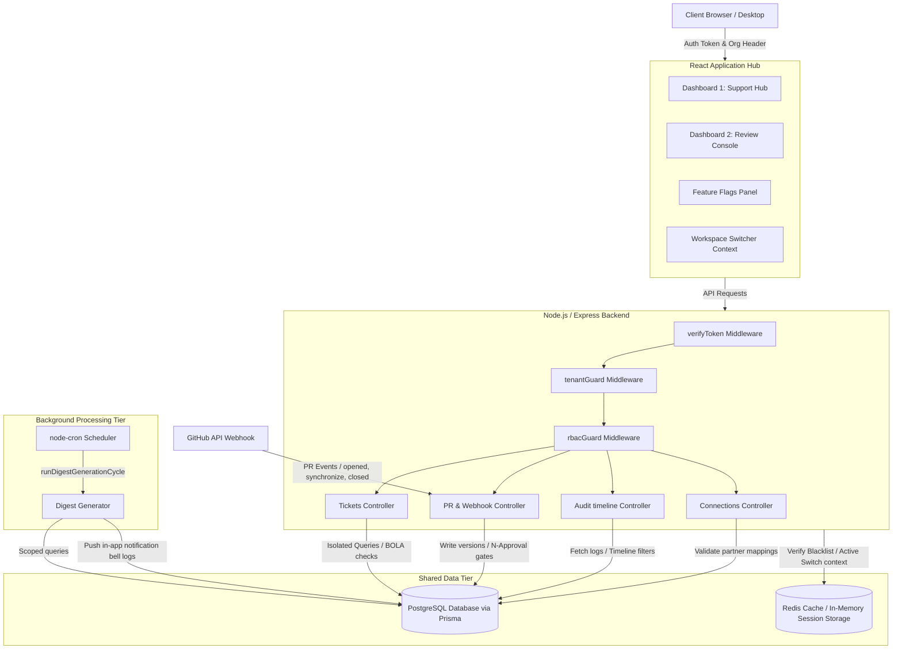

# System Architecture Diagram

This document defines the high-level system architecture of the Unified Organization Workspace, showing the connection between the identity layer, PostgreSQL/Prisma database, Redis session manager, and the two dashboard application contexts.

---

## Architecture Components Description

1. **Frontend Hub (`workspace-frontend`)**:
   - Single-page application rendering both dashboards inside a unified layout.
   - Shares a central `WorkspaceContext` to orchestrate token checks and organization contexts.
   
2. **Backend Gateway (`workspace-backend`)**:
   - Handles the token validation and role context parameters (`ORG_ADMIN`, `SUPPORT_AGENT`, `REVIEWER`, `SUPER_ADMIN`).
   - Implements **BOLA (Broken Object Level Authorization)** protections directly in the controller queries.

3. **Shared PostgreSQL Database**:
   - Acts as the single source of truth for user credentials, memberships, tickets, pull requests, versions, connections, and audit trails.

4. **Redis Session Storage**:
   - Provides global session revocation checks (token blacklisting on logout) and live context switching state caches across instances.
